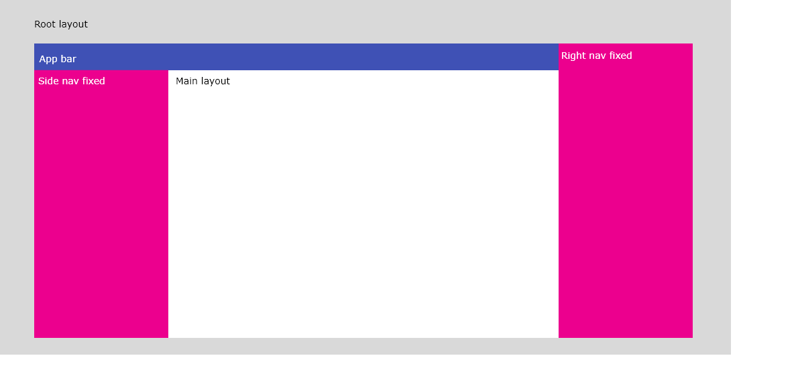
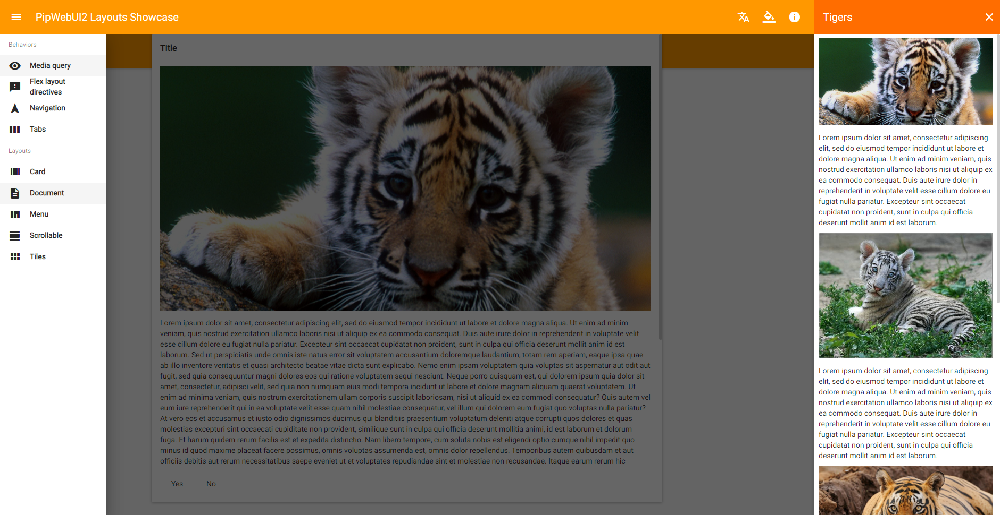
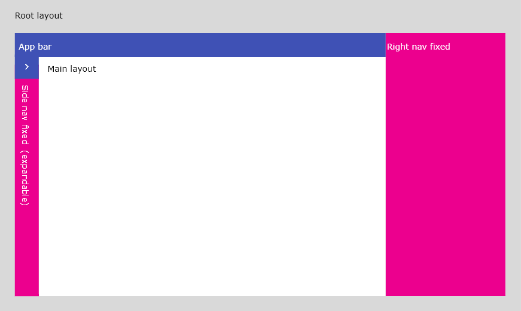
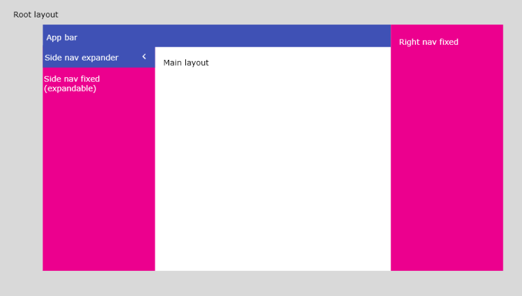
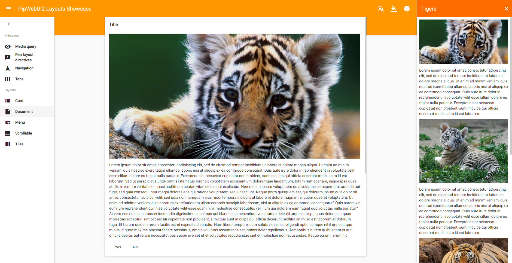
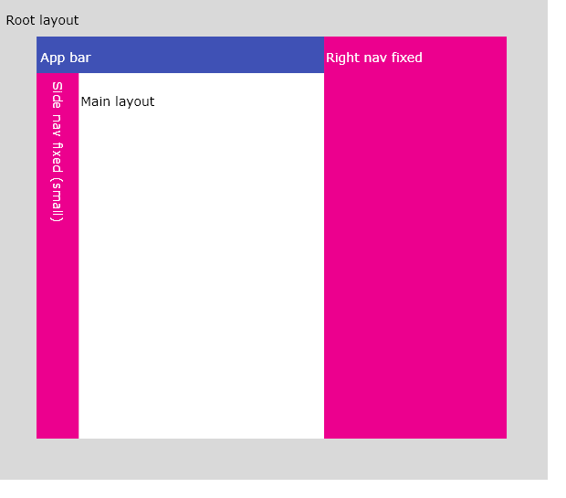
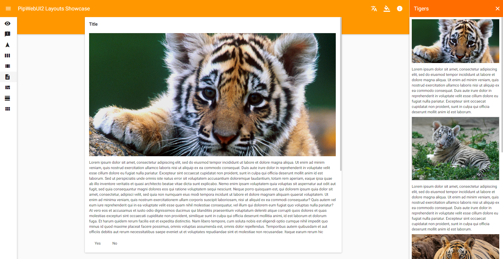
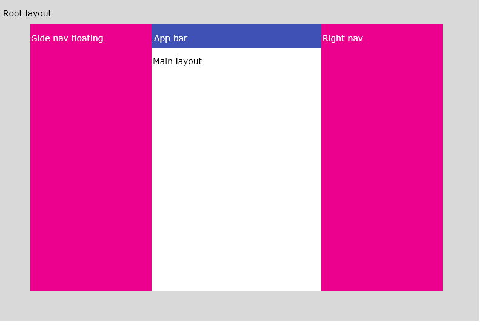
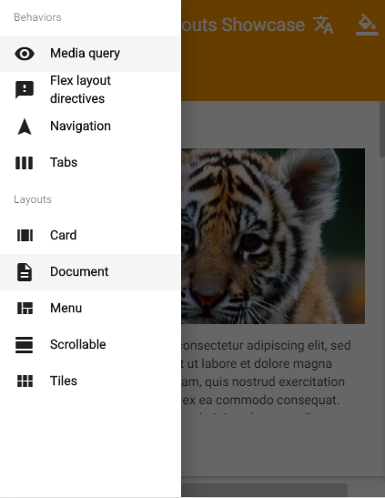

[↑ Main contents](contents.md)

## Contents
* [App bar](#app-bar)
* [Media](#media)
* [Sidenavs (start and end)](#sidenavs)

## App bar

App bar is more powerfull tool of `mat-toolbar`. It's single instance should be used as header of application. Improvement behavior includes ability to set list of tabs which are binded to Angular router and could looks like an usual dropdown select in case if there's not enough space for all tabs.

#### `PipAppbarTab` model
```typescript
class PipAppbarTab {
    /**
     * Name or name resolver
     */
    name: string | (() => string);
    /**
     * Route for @angular/router
     */
    route: {
        /**
         * Route path
         */
        path: string[],
        /**
         * Route navigation extras
         */
        extras?: NavigationExtras
    };
    /**
     * Deafult tab flag
     */
    isDefault?: boolean;
}
```

#### `PipAppbarService` service

Properties:
* `color` - ink color of appbar;
* `bgColor` - background color of appbar;
* `fallbackToSelect` - determine behavior of fallback;
* `fallbackSize` - alias which using as condition NOT to fallback (it won't fallback until this alias is active);
* `tabs` - array of tabs;
* `activeIdx` and `activeTab` returns index of active tab and it's object.

Both `color` and `bgColor` accepts default palettes 'primary', 'accent' and 'warn'. If you need some custom colors - use `themes.scss` file to modify styles of the app bar.

## Media

`PipMediaModule` module provides additional directives and set active breakpoints in `body`.

### Directives

#### PipShowHideDirective

Provides fx* directives for show and hide for new breakpoints: `document-lt-lg` and `document-lg`. Provided by `PipMediaModule`.

#### PipResizeDirective

Watch for size of content and emit events when it's changed. Provided by `PipMediaModule`.

Outputs:
* `pipResize` emit event when size changed;

```typescript
class PipResizeEvent {
    readonly element: ElementRef;
    readonly newWidth: number;
    readonly newHeight: number;
    readonly oldWidth: number;
    readonly oldHeight: number;
}
```

Example:
```html
<div (pipResize)="callOnResize($event)">
</div>
```

### Services

#### PipMediaService

This service allows to know which breakpoints of main layout is currently active. Provided by `PipMediaModule.forRoot()`.

Methods:
* `isMainActive(alias: string)` - check if alias is active;
* `asObservableMain()` - returns observable of main aliases changes.

### Constants

There's single constant for breakpoints called `PIP_BREAKPOINTS`. It's provided by `PipMediaModule.forRoot()` and could be retrieved by injecting `BreakPointRegistry`.

## Sidenavs

Side navigation presented by 2 services: `PipSidenavStartService` and `PipSidenavEndService` which provided in 'root'. You could set initial configuration of `PipSidenavModule` by import `PipSidenavModule.withConfig(config)`.

That's how config model looks like:
```typescript
/**
 * Configuration of sidenav
 */
export class PipSidenavConfig {
    /**
     * Opened on startup
     */
    opened?: boolean;
    /**
     * Active by default
     */
    active?: boolean;
    /**
     * List of views
     */
    views?: PipSidenavView[];
}
```

Sidenav "View" is a list of conditions and options that should be set. Each of sidenavs has it's own default view without `alias` property. Any other view require this property.

This how `PipSidenavView` model and some enums looks like:
```typescript
enum PipSidenavPosition {
    Root = 'root',
    Main = 'main'
}

enum PipSidenavSide {
    Start = 'start',
    End = 'end'
}

class PipSidenavView {
    /** Name of view */
    public name: string;
    /** Position where view will be placed */
    public position: PipSidenavPosition;
    /** Alias to activate view */
    public alias?: string | string[];
    /** Mode of sidenav  */
    public mode?: MatDrawerMode;
    /** View can be collapsed */
    public collapseable?: boolean;
    /** View is collapsed by default */
    public collapsed?: boolean;
    /** View is opened by default */
    public opened?: boolean;
    /** View is active by default @default true */
    public active?: boolean;
    /** View is fixed in viewport */
    public fixedInViewport?: boolean;
    /** Top gap for fixed in viewport view */
    public fixedTopGap?: number;
    /** Bottom gap for fixed in viewport view */
    public fixedBottomGap?: number;
    /** View width @default 200 */
    public width?: number;
    /** View collapsed width @default 64 */
    public widthCollapsed?: number;
}
```

### `PipSidenavStartService` and `PipSidenavEndService`

Properties:
* `active` and `active$` - turn on/off open and collapse behaviors;
* `collapsed` and `collapsed$` - expand and collapse sidenav;
* `opened` and `opened$` - toggle sidenav;
* `defaultView` and `defaultView$` - settings for default view;
* `views` and `views$` - list of non-default views;
* `allViews` and `allViews$` - list of all views, including default one;
* `currentView` and `currentView$` - current view.

Methods:
* `open`, `close` and `toggle` - to show or hide sidenav;
* `expand`, `collapse` and `toggleCollapse` - to expand or collapse sidenav;
* `createView` - create and register new view;
* `updateView` - update view by it's name. Could update 'default' view aswell;
* `removeView` - remove view by name. Default view can't be removed;
* `removeViewAt` - remove view from some position. 'default' view is NOT included, so be careful with position.

### Examples

Different behaviors could be achieved by set different views. Here's some examples of views for `start` and `end` sidenavs.

#### Desktop layout

```typescript
PipSidenavModule.withConfig({
    start: {
        name: 'default',
        position: 'main',
        mode: 'over'
    },
    end: {
        name: 'default',
        position: 'root',
        mode: 'side'
    }
})
```


### Tablet layout


```typescript
PipSidenavModule.withConfig({
    start: {
        name: 'default',
        position: 'main',
        mode: 'side',
        collapseable: true
    },
    end: {
        name: 'default',
        position: 'root',
        mode: 'side'
    }
})
```


#### Fablet layout

```typescript
PipSidenavModule.withConfig({
    start: {
        name: 'default',
        position: 'main',
        mode: 'side',
        collapsed: true
    },
    end: {
        name: 'default',
        position: 'root',
        mode: 'side'
    }
})
```


#### Mobile layout

```typescript
PipSidenavModule.withConfig({
    start: {
        name: 'default',
        position: 'root',
        mode: 'over'
    },
    end: {
        name: 'default',
        position: 'root',
        mode: 'over'
    }
})
```

